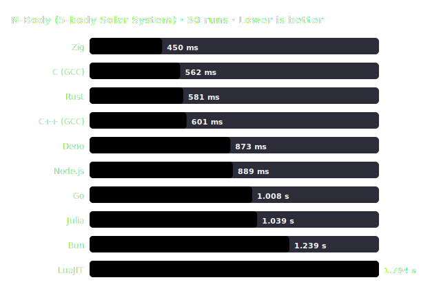

# N-Body Benchmark Report — 2026-07-02_linux_x86_64_run1

> **Benchmark Variant:** Computer Language Benchmarks Game · 5-body Solar System

## 🖥️ System Environment

| Field | Value |
| :--- | :--- |
| Date | 2026-07-02, 21:28:00 |
| OS | Linux 7.0.14-zen1-1-zen |
| CPU | Intel(R) Core(TM) i5-14600KF |
| Cores / Threads | N/A cores, N/A threads |
| RAM | N/A @ N/A |

## 🔬 Benchmark Specifications

| Parameter | Value |
| :--- | :--- |
| Benchmark variant | Computer Language Benchmarks Game — 5-body Solar System |
| Bodies | 5 (Sun, Jupiter, Saturn, Uranus, Neptune) |
| Steps | 20,000,000 |
| dt | 0.01 |
| Threading | Single-threaded |
| Output (inside loop) | None — only final energy value printed as correctness checksum |
| Native ISA optimization | `-march=native` / `/arch:AVX2` enabled for compiled languages; automatic vectorization depends on each compiler's optimizer |
| Benchmark tool | hyperfine 1.20.0 |
| Runs | 30 (+ 1 warmup to allow JIT stabilisation) |
| Statistics | Mean, Median, Min, Max, StdDev, CV |

## 🛠️ Compiler / Runtime Configuration

| Language | Runtime / Compiler | Optimization Flags | Notes |
| :--- | :--- | :--- | :--- |
| C | GCC 16.1.1 | `-O3 -march=native -ffast-math` | |
| C++ | G++ 16.1.1 | `-O3 -march=native -ffast-math` | |
| Rust | rustc 1.96.1 | `opt-level=3, codegen-units=1, panic=abort, target-cpu=native, lto=thin` | `Vec<Body>` (heap); `unsafe` inner loop |
| Zig | zig 0.16.0 | `-O ReleaseFast` | `[5]Body` stack array; compile-time bounds |
| Go | go 1.26.4 | `-ldflags "-s -w"` | No explicit SIMD; GC pauses may affect variance |
| Julia | julia 1.12.6 | `@fastmath` + `@inbounds` | LLVM JIT; JIT overhead present even after warmup |
| JavaScript | node v24.18.0 (V8 TurboFan) | — | `Float64Array` typed arrays |
| JavaScript | deno 2.9.0 (V8 TurboFan) | — | `Float64Array` typed arrays |
| JavaScript | bun 1.3.14 (JSC JIT) | — | `Float64Array` typed arrays |
| Lua | luajit 2.1.1780076327 (DynASM JIT) | — | Plain Lua tables; no FFI |

## ✅ Correctness Verification

All implementations run with **1,000 steps** and their initial system energy is compared against the reference value.

> **Reference energyBefore** = `-0.169075164` (tolerance ± 0.000001)

| Runtime | energyBefore | energyAfter (1k steps) | Result |
| :--- | :---: | :---: | :---: |
| C (GCC) | `-0.169075164` | `-0.169087605` | ✅ PASS |
| C++ (GCC) | `-0.169075164` | `-0.169031665` | ✅ PASS |
| Rust | `-0.169075164` | `-0.169087605` | ✅ PASS |
| Zig | `-0.169075164` | `-0.169087605` | ✅ PASS |
| Go | `-0.169075164` | `-0.169087605` | ✅ PASS |
| Julia | `-0.169075164` | `-0.169087605` | ✅ PASS |
| Node.js | `-0.169075164` | `-0.169031665` | ✅ PASS |
| Deno | `-0.169075164` | `-0.169031665` | ✅ PASS |
| Bun | `-0.169075164` | `-0.169031665` | ✅ PASS |
| LuaJIT | `-0.169075164` | `-0.169087605` | ✅ PASS |

## 📊 Performance Chart

## 📈 Results (sorted by mean time)

| # | Runtime | Compiler / Version | Min | Median | Mean | Max | StdDev | CV | Relative Runtime |
| :---: | :--- | :--- | :---: | :---: | :---: | :---: | :---: | :---: | :---: |
| 1 | **Zig** | zig 0.16.0 `[-O ReleaseFast]` | 442.9 ms | 448.3 ms | 449.9 ms | 465.6 ms | 6.2 ms | 1.4% | 1.00× _(fastest)_ |
| 2 | **C (GCC)** | GCC 16.1.1 `[-O3 -march=native -ffast-math]` | 557.5 ms | 560.5 ms | 561.9 ms | 579.8 ms | 5.2 ms | 0.9% | 1.25× |
| 3 | **Rust** | rustc 1.96.1 `[opt-level=3, target-cpu=native, lto=thin]` | 572.7 ms | 581.9 ms | 580.9 ms | 594.9 ms | 5.8 ms | 1.0% | 1.29× |
| 4 | **C++ (GCC)** | G++ 16.1.1 `[-O3 -march=native -ffast-math]` | 596.8 ms | 598.1 ms | 601.1 ms | 614.0 ms | 4.9 ms | 0.8% | 1.34× |
| 5 | **Deno** | deno 2.9.0 `[V8 TurboFan JIT]` | 866.0 ms | 871.9 ms | 873.0 ms | 903.1 ms | 6.9 ms | 0.8% | 1.94× |
| 6 | **Node.js** | node v24.18.0 `[V8 TurboFan JIT]` | 883.2 ms | 888.9 ms | 888.9 ms | 899.2 ms | 3.9 ms | 0.4% | 1.98× |
| 7 | **Go** | go 1.26.4 `[-ldflags "-s -w"]` | 1.003 s | 1.007 s | 1.008 s | 1.033 s | 5.5 ms | 0.5% | 2.24× |
| 8 | **Julia** | julia 1.12.6 `[@fastmath + @inbounds]` | 1.025 s | 1.034 s | 1.039 s | 1.090 s | 15.8 ms | 1.5% | 2.31× |
| 9 | **Bun** | bun 1.3.14 `[JSC JIT]` | 1.231 s | 1.237 s | 1.239 s | 1.257 s | 6.7 ms | 0.5% | 2.75× |
| 10 | **LuaJIT** | luajit 2.1.1780076327 `[JIT (DYJIT)]` | 1.772 s | 1.794 s | 1.794 s | 1.808 s | 7.0 ms | 0.4% | 3.99× |

## 📝 Implementation Notes & Fairness

- **Algorithm**: All implementations use the same O(n²) pairwise force calculation with identical initial conditions.
- **Zig vs Rust gap**: Zig uses a compile-time `[5]Body` stack array enabling full inlining and bound elimination; Rust uses `Vec<Body>` (heap) with `unsafe` raw-pointer inner loop. This structural difference, not compiler quality, explains the gap.
- **MSVC vs GCC**: With `/arch:AVX2 /GL /LTCG` enabled, the gap narrows compared to `/O2` alone.
- **JIT runtimes** (Julia, Node, Deno, Bun, LuaJIT): 1 warmup run included before timing; true JIT steady-state may require more iterations to fully optimise.
- **Go GC**: Go's garbage collector may introduce occasional pauses visible in max/StdDev spread.
- **LuaJIT**: Uses standard Lua tables (no FFI). FFI-based implementations can be several times faster.

