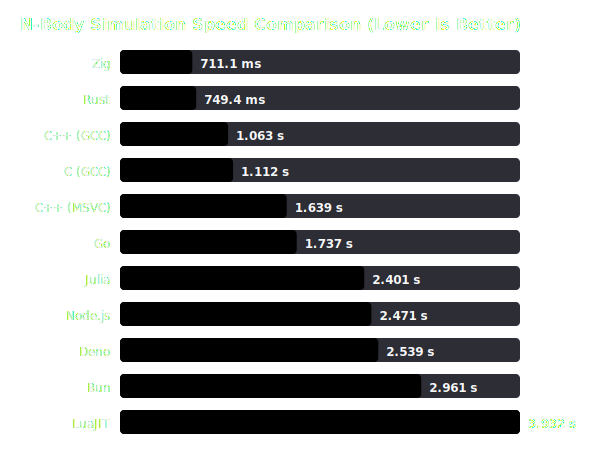

# N-Body 模拟跑分自动汇总报告 (2026-07-02_windows_x86_64_run1)

## 🖥️ 系统环境 (System Environment)
- **日期 (Date)**: 7/2/2026, 5:46:22 PM
- **操作系统 (OS)**: windows x86_64
- **处理器 (CPU)**: Intel(R) Core(TM) i7-7700 CPU @ 3.60GHz

## 📊 性能可视化图表 (Visualization Chart)

## 📈 性能数据排行榜 (Sorted by Speed)

| 排名 | 运行环境 / 编译器 | 版本与编译配置细节 | 平均耗时 | 标准差 | 相对速度 (相比最快) |
| :---: | :--- | :--- | :---: | :---: | :---: |
| 1 | **Zig** | Zig 0.16.0 | 711.1 ms | 8.8 ms | 1.00x (最快) 🏆 |
| 2 | **Rust** | Rust 1.96.1 | 749.4 ms | 9.4 ms | 1.05x 慢 |
| 3 | **C++ (GCC)** | G++ 16.1.0 | 1.063 s | 42.2 ms | 1.49x 慢 |
| 4 | **C (GCC)** | GCC 16.1.0 | 1.112 s | 131.9 ms | 1.56x 慢 |
| 5 | **C++ (MSVC)** | MSVC 19.51.36246 | 1.639 s | 26.9 ms | 2.30x 慢 |
| 6 | **Go** | Go 1.26.4 | 1.737 s | 13.0 ms | 2.44x 慢 |
| 7 | **Julia** | Julia 1.12.6 | 2.401 s | 14.3 ms | 3.38x 慢 |
| 8 | **Node.js** | Node v24.18.0 | 2.471 s | 70.5 ms | 3.48x 慢 |
| 9 | **Deno** | Deno 2.9.1 | 2.539 s | 85.2 ms | 3.57x 慢 |
| 10 | **Bun** | Bun 1.3.14 | 2.961 s | 34.0 ms | 4.16x 慢 |
| 11 | **LuaJIT** | LuaJIT 2.1.1779665312 | 3.932 s | 189.4 ms | 5.53x 慢 |
