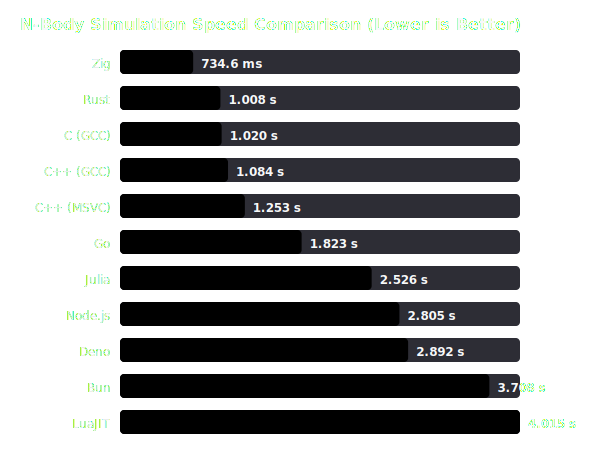

# N-Body 模拟跑分自动汇总报告 (2026-07-02_windows_x86_64_run2)

## 🖥️ 系统环境 (System Environment)
- **日期 (Date)**: 7/2/2026, 5:55:19 PM
- **操作系统 (OS)**: Microsoft Windows [Version 10.0.19045.7417]
- **处理器 (CPU)**: Intel(R) Core(TM) i7-7700 CPU @ 3.60GHz (4 Cores, 8 Threads)
- **运行内存 (RAM)**: 32 GB @ 2400 MHz
- **系统电源计划 (Power Plan)**: N/A

## 🔬 测试规格与技术参数 (Benchmark Specifications)
- **星体数量 (Bodies)**: 5 (太阳、木星、土星、天王星、海王星)
- **迭代步数 (Steps)**: 20,000,000 步
- **时间步长 (dt)**: 0.01
- **测试样本数 (Hyperfine Runs)**: 30 次运行 (前置 1 次 Warmup 热身，取平均值与标准差)
- **IO 输出控制 (Output)**: 循环体内输出被完全禁止 (仅在最终一步输出 1 行 JSON 测量结果)
- **线程模式 (Threading)**: 单线程 (Single-threaded)
- **SIMD 硬件加速 (SIMD)**: 开启 (Zig, Rust, C, C++ 均使用编译优化参数 `-march=native -ffast-math` 或 `/fp:fast`；Julia 启用 `@fastmath` 与 `@inbounds` 自动向量化)

## 📊 性能可视化图表 (Visualization Chart)

## 📈 性能数据排行榜 (Sorted by Speed)

| 排名 | 运行环境 / 编译器 | 版本与编译配置优化参数 | Min | Max | Median | 平均时间 (Mean) | 标准差 (StdDev) | 相对耗时 (Relative) |
| :---: | :--- | :--- | :---: | :---: | :---: | :---: | :---: | :---: |
| 1 | **Zig** | Zig 0.16.0 (-O ReleaseFast) | 712.6 ms | 893.1 ms | 722.7 ms | 734.6 ms | 33.5 ms | 1.00× |
| 2 | **Rust** | Rust 1.96.1 (opt-level=3 target-cpu=native LTO) | 980.3 ms | 1.044 s | 1.008 s | 1.008 s | 17.3 ms | 1.37× |
| 3 | **C (GCC)** | GCC 16.1.0 (-O3 -march=native -ffast-math) | 992.6 ms | 1.071 s | 1.009 s | 1.020 s | 23.1 ms | 1.39× |
| 4 | **C++ (GCC)** | G++ 16.1.0 (-O3 -march=native -ffast-math) | 1.028 s | 1.261 s | 1.073 s | 1.084 s | 51.5 ms | 1.48× |
| 5 | **C++ (MSVC)** | MSVC 19.51.36246 (/O2 /fp:fast /arch:AVX2 /GL /link /LTCG) | 1.225 s | 1.361 s | 1.248 s | 1.253 s | 26.7 ms | 1.71× |
| 6 | **Go** | Go 1.26.4 (-ldflags "-s -w") | 1.752 s | 2.078 s | 1.806 s | 1.823 s | 68.3 ms | 2.48× |
| 7 | **Julia** | Julia 1.12.6 (LLVM JIT @fastmath) | 2.442 s | 3.176 s | 2.475 s | 2.526 s | 152.2 ms | 3.44× |
| 8 | **Node.js** | Node v24.18.0 (V8 JIT) | 2.606 s | 3.362 s | 2.758 s | 2.805 s | 169.2 ms | 3.82× |
| 9 | **Deno** | Deno 2.9.1 (V8 JIT) | 2.457 s | 4.949 s | 2.729 s | 2.892 s | 470.6 ms | 3.94× |
| 10 | **Bun** | Bun 1.3.14 (JSC JIT) | 2.959 s | 5.592 s | 3.467 s | 3.708 s | 688.3 ms | 5.05× |
| 11 | **LuaJIT** | LuaJIT 2.1.1779665312 (JIT) | 3.853 s | 4.865 s | 3.938 s | 4.015 s | 204.0 ms | 5.47× |
