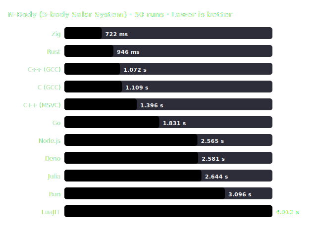

# N-Body Benchmark Report — 2026-07-02_windows_x86_64_run3

> **Benchmark Variant:** Computer Language Benchmarks Game · 5-body Solar System

## 🖥️ System Environment

| Field | Value |
| :--- | :--- |
| Date | 2026-07-02, 18:19:08 |
| OS | Microsoft Windows [Version 10.0.19045.7417] |
| CPU | Intel(R) Core(TM) i7-7700 CPU @ 3.60GHz |
| Cores / Threads | 4 cores, 8 threads |
| RAM | 32 GB @ 2400 MHz |

## 🔬 Benchmark Specifications

| Parameter | Value |
| :--- | :--- |
| Benchmark variant | Computer Language Benchmarks Game — 5-body Solar System |
| Bodies | 5 (Sun, Jupiter, Saturn, Uranus, Neptune) |
| Steps | 20,000,000 |
| dt | 0.01 |
| Threading | Single-threaded |
| Output (inside loop) | None — only final energy value printed as correctness checksum |
| Native ISA optimization | `-march=native` / `/arch:AVX2` enabled for compiled languages; automatic vectorization depends on each compiler's optimizer |
| Benchmark tool | hyperfine 1.20.0 |
| Runs | 30 (+ 1 warmup to allow JIT stabilisation) |
| Statistics | Mean, Median, Min, Max, StdDev, CV |

## 🛠️ Compiler / Runtime Configuration

| Language | Runtime / Compiler | Optimization Flags | Notes |
| :--- | :--- | :--- | :--- |
| C | GCC 16.1.0 | `-O3 -march=native -ffast-math` | |
| C++ | G++ 16.1.0 | `-O3 -march=native -ffast-math` | |
| C++ | cl 19.51.36246 | `/O2 /fp:fast /arch:AVX2 /GL /LTCG` | Global optimization + Link-time code gen |
| Rust | rustc 1.96.1 | `opt-level=3, codegen-units=1, panic=abort, target-cpu=native, lto=thin` | `Vec<Body>` (heap); `unsafe` inner loop |
| Zig | zig 0.16.0 | `-O ReleaseFast` | `[5]Body` stack array; compile-time bounds |
| Go | go 1.26.4 | `-ldflags "-s -w"` | No explicit SIMD; GC pauses may affect variance |
| Julia | julia 1.12.6 | `@fastmath` + `@inbounds` | LLVM JIT; JIT overhead present even after warmup |
| JavaScript | node v24.18.0 (V8 TurboFan) | — | `Float64Array` typed arrays |
| JavaScript | deno 2.9.1 (V8 TurboFan) | — | `Float64Array` typed arrays |
| JavaScript | bun 1.3.14 (JSC JIT) | — | `Float64Array` typed arrays |
| Lua | luajit 2.1.1779665312 (DynASM JIT) | — | Plain Lua tables; no FFI |

## ✅ Correctness Verification

All implementations run with **1,000 steps** and their initial system energy is compared against the reference value.

> **Reference energyBefore** = `-0.169075164` (tolerance ± 0.000001)

| Runtime | energyBefore | energyAfter (1k steps) | Result |
| :--- | :---: | :---: | :---: |
| C (GCC) | `N/A` | `N/A` | ❌ FAIL (SyntaxError: Unexpected token 'i', ..."
  "ips": inf
}" is not valid JSON) |
| C++ (GCC) | `-0.169075164` | `-0.169031665` | ✅ PASS |
| Rust | `-0.169075164` | `-0.169087605` | ✅ PASS |
| Zig | `N/A` | `N/A` | ❌ FAIL (no JSON in stdout) |
| Go | `N/A` | `N/A` | ❌ FAIL (SyntaxError: Unexpected token '+', ..."
  "ips": +Inf
}" is not valid JSON) |
| Julia | `-0.169075164` | `-0.169087605` | ✅ PASS |
| Node.js | `-0.169075164` | `-0.169031665` | ✅ PASS |
| Deno | `-0.169075164` | `-0.169031665` | ✅ PASS |
| Bun | `-0.169075164` | `-0.169031665` | ✅ PASS |
| LuaJIT | `N/A` | `N/A` | ❌ FAIL (SyntaxError: Unexpected token 'i', ..."
  "ips": inf
}" is not valid JSON) |
| C++ (MSVC) | `-0.169075164` | `-0.169031665` | ✅ PASS |

## 📊 Performance Chart

## 📈 Results (sorted by mean time)

| # | Runtime | Compiler / Version | Min | Median | Mean | Max | StdDev | CV | Relative Runtime |
| :---: | :--- | :--- | :---: | :---: | :---: | :---: | :---: | :---: | :---: |
| 1 | **Zig** | zig 0.16.0 `[-O ReleaseFast]` | 709.0 ms | 718.5 ms | 721.6 ms | 749.9 ms | 10.6 ms | 1.5% | 1.00× _(fastest)_ |
| 2 | **Rust** | rustc 1.96.1 `[opt-level=3, target-cpu=native, lto=thin]` | 916.3 ms | 934.2 ms | 945.7 ms | 1.075 s | 36.2 ms | 3.8% | 1.31× |
| 3 | **C++ (GCC)** | G++ 16.1.0 `[-O3 -march=native -ffast-math]` | 1.032 s | 1.057 s | 1.072 s | 1.199 s | 43.8 ms | 4.1% | 1.49× |
| 4 | **C (GCC)** | GCC 16.1.0 `[-O3 -march=native -ffast-math]` | 1.005 s | 1.077 s | 1.109 s | 1.610 s | 128.4 ms | 11.6% | 1.54× |
| 5 | **C++ (MSVC)** | cl 19.51.36246 `[/O2 /fp:fast /arch:AVX2 /GL /LTCG]` | 1.243 s | 1.347 s | 1.396 s | 2.082 s | 205.0 ms | 14.7% | 1.93× |
| 6 | **Go** | go 1.26.4 `[-ldflags "-s -w"]` | 1.773 s | 1.800 s | 1.831 s | 2.469 s | 123.4 ms | 6.7% | 2.54× |
| 7 | **Node.js** | node v24.18.0 `[V8 TurboFan JIT]` | 2.495 s | 2.545 s | 2.565 s | 2.891 s | 83.0 ms | 3.2% | 3.55× |
| 8 | **Deno** | deno 2.9.1 `[V8 TurboFan JIT]` | 2.505 s | 2.556 s | 2.581 s | 2.900 s | 85.0 ms | 3.3% | 3.58× |
| 9 | **Julia** | julia 1.12.6 `[@fastmath + @inbounds]` | 2.476 s | 2.558 s | 2.644 s | 3.474 s | 218.3 ms | 8.3% | 3.66× |
| 10 | **Bun** | bun 1.3.14 `[JSC JIT]` | 2.994 s | 3.041 s | 3.096 s | 3.503 s | 140.7 ms | 4.5% | 4.29× |
| 11 | **LuaJIT** | luajit 2.1.1779665312 `[JIT (DYJIT)]` | 3.872 s | 3.964 s | 4.013 s | 4.498 s | 143.3 ms | 3.6% | 5.56× |

## 📝 Implementation Notes & Fairness

- **Algorithm**: All implementations use the same O(n²) pairwise force calculation with identical initial conditions.
- **Zig vs Rust gap**: Zig uses a compile-time `[5]Body` stack array enabling full inlining and bound elimination; Rust uses `Vec<Body>` (heap) with `unsafe` raw-pointer inner loop. This structural difference, not compiler quality, explains the gap.
- **MSVC vs GCC**: With `/arch:AVX2 /GL /LTCG` enabled, the gap narrows compared to `/O2` alone.
- **JIT runtimes** (Julia, Node, Deno, Bun, LuaJIT): 1 warmup run included before timing; true JIT steady-state may require more iterations to fully optimise.
- **Go GC**: Go's garbage collector may introduce occasional pauses visible in max/StdDev spread.
- **LuaJIT**: Uses standard Lua tables (no FFI). FFI-based implementations can be several times faster.

