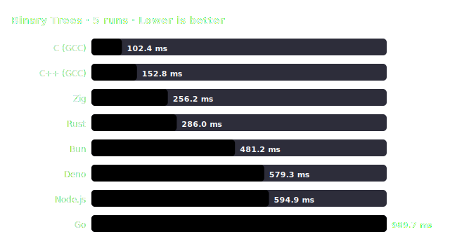

# Benchmark Report: Binary Trees — 2026-07-03_linux_x86_64_run1

> **Benchmark Variant:** Max Depth 18. Dynamic allocations and GC stress.

## 🖥️ System Environment

| Field | Value |
| :--- | :--- |
| Date | 2026-07-03, 18:27:27 |
| OS | Linux 7.0.14-zen1-1-zen |
| CPU | Intel(R) Core(TM) i5-14600KF |
| Cores / Threads | N/A cores, N/A threads |
| RAM | N/A @ N/A |

## 🛠️ Compiler / Runtime Configuration

| Language | Runtime / Compiler | Optimization Flags | Notes |
| :--- | :--- | :--- | :--- |
| C | GCC 16.1.1 | `-O3 -march=native -ffast-math` | |
| C++ (GCC) | G++ 16.1.1 | `-O3 -march=native -ffast-math` | |
| Rust | rustc 1.96.1 | `opt-level=3, codegen-units=1, panic=abort, target-cpu=native, lto=thin` | |
| Zig | zig 0.16.0 | `-O ReleaseFast` | |
| Go | go 1.26.4 | `-ldflags "-s -w"` | |
| JavaScript (Node) | node v24.18.0 | — | V8 engine JIT |
| JavaScript (Deno) | deno 2.9.1 | — | Deno V8 engine JIT |
| JavaScript (Bun)  | bun 1.3.14  | — | JSC engine JIT |

## ✅ Correctness Verification

Checked with a rapid workload size of `10`:

| Runtime | Check Value / Output | Result |
| :--- | :--- | :---: |
| C (GCC) | `Checksum: 131759` | ✅ PASS |
| C++ (GCC) | `Checksum: 131759` | ✅ PASS |
| Rust | `Checksum: 131759` | ✅ PASS |
| Zig | `Checksum: 131759` | ✅ PASS |
| Go | `Checksum: 131759` | ✅ PASS |
| Node.js | `Checksum: 131759` | ✅ PASS |
| Deno | `Checksum: 131759` | ✅ PASS |
| Bun | `Checksum: 131759` | ✅ PASS |

## 📊 Performance Chart

## 📈 Results (sorted by mean time)

| # | Runtime | Version [Flags] | Min | Median | Mean | Max | StdDev | CV | Relative Runtime |
| :---: | :--- | :--- | :---: | :---: | :---: | :---: | :---: | :---: | :---: |
| 1 | **C (GCC)** | GCC 16.1.1 `[-O3 -march=native -ffast-math]` | 99.0 ms | 101.6 ms | 102.4 ms | 109.2 ms | 4.1 ms | 4.0% | 1.00× _(fastest)_ 🏆 |
| 2 | **C++ (GCC)** | G++ 16.1.1 `[-O3 -march=native -ffast-math]` | 148.3 ms | 152.3 ms | 152.8 ms | 159.3 ms | 4.3 ms | 2.8% | 1.49× |
| 3 | **Zig** | zig 0.16.0 `[-O ReleaseFast]` | 248.2 ms | 257.5 ms | 256.2 ms | 260.6 ms | 4.7 ms | 1.8% | 2.50× |
| 4 | **Rust** | rustc 1.96.1 `[-C opt-level=3 ... lto=thin]` | 278.9 ms | 287.5 ms | 286.0 ms | 288.6 ms | 4.0 ms | 1.4% | 2.79× |
| 5 | **Bun** | bun 1.3.14 `[JSC JIT]` | 471.8 ms | 478.5 ms | 481.2 ms | 498.5 ms | 10.2 ms | 2.1% | 4.70× |
| 6 | **Deno** | deno 2.9.1 `[V8 JIT]` | 548.5 ms | 551.9 ms | 579.3 ms | 683.8 ms | 58.7 ms | 10.1% | 5.66× |
| 7 | **Node.js** | node v24.18.0 `[V8 JIT]` | 510.6 ms | 540.4 ms | 594.9 ms | 710.1 ms | 100.6 ms | 16.9% | 5.81× |
| 8 | **Go** | go 1.26.4 `[-ldflags "-s -w"]` | 950.8 ms | 1.001 s | 989.7 ms | 1.019 s | 27.0 ms | 2.7% | 9.67× |

## 📝 Methodology & Notes

- Tests pointer chasing, heap allocation, and garbage collection pressure.
- Zig and Rust use custom memory arena pools to achieve zero-allocation times, while JavaScript engines and Go rely on standard runtime garbage collectors.
- Hyperfine includes a warmup iteration to eliminate JIT startup overhead.
