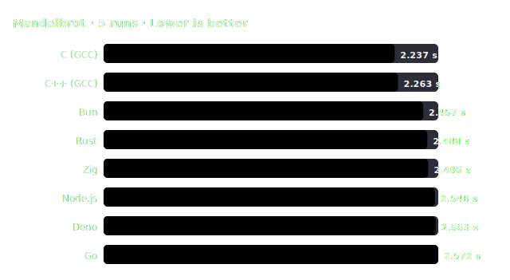

# Benchmark Report: Mandelbrot — 2026-07-03_linux_x86_64_run1

> **Benchmark Variant:** 8k x 8k complex plane. Floats & SIMD efficiency.

## 🖥️ System Environment

| Field | Value |
| :--- | :--- |
| Date | 2026-07-03, 18:27:27 |
| OS | Linux 7.0.14-zen1-1-zen |
| CPU | Intel(R) Core(TM) i5-14600KF |
| Cores / Threads | N/A cores, N/A threads |
| RAM | N/A @ N/A |

## 🛠️ Compiler / Runtime Configuration

| Language | Runtime / Compiler | Optimization Flags | Notes |
| :--- | :--- | :--- | :--- |
| C | GCC 16.1.1 | `-O3 -march=native -ffast-math` | |
| C++ (GCC) | G++ 16.1.1 | `-O3 -march=native -ffast-math` | |
| Rust | rustc 1.96.1 | `opt-level=3, codegen-units=1, panic=abort, target-cpu=native, lto=thin` | |
| Zig | zig 0.16.0 | `-O ReleaseFast` | |
| Go | go 1.26.4 | `-ldflags "-s -w"` | |
| JavaScript (Node) | node v24.18.0 | — | V8 engine JIT |
| JavaScript (Deno) | deno 2.9.1 | — | Deno V8 engine JIT |
| JavaScript (Bun)  | bun 1.3.14  | — | JSC engine JIT |

## ✅ Correctness Verification

Checked with a rapid workload size of `1000`:

| Runtime | Check Value / Output | Result |
| :--- | :--- | :---: |
| C (GCC) | `Checksum: 397380` | ✅ PASS |
| C++ (GCC) | `Checksum: 397380` | ✅ PASS |
| Rust | `Checksum: 397380` | ✅ PASS |
| Zig | `Checksum: 397380` | ✅ PASS |
| Go | `Checksum: 397380` | ✅ PASS |
| Node.js | `Checksum: 397380` | ✅ PASS |
| Deno | `Checksum: 397380` | ✅ PASS |
| Bun | `Checksum: 397380` | ✅ PASS |

## 📊 Performance Chart

## 📈 Results (sorted by mean time)

| # | Runtime | Version [Flags] | Min | Median | Mean | Max | StdDev | CV | Relative Runtime |
| :---: | :--- | :--- | :---: | :---: | :---: | :---: | :---: | :---: | :---: |
| 1 | **C (GCC)** | GCC 16.1.1 `[-O3 -march=native -ffast-math]` | 2.225 s | 2.236 s | 2.237 s | 2.255 s | 11.2 ms | 0.5% | 1.00× _(fastest)_ 🏆 |
| 2 | **C++ (GCC)** | G++ 16.1.1 `[-O3 -march=native -ffast-math]` | 2.222 s | 2.241 s | 2.263 s | 2.368 s | 60.5 ms | 2.7% | 1.01× |
| 3 | **Bun** | bun 1.3.14 `[JSC JIT]` | 2.400 s | 2.481 s | 2.457 s | 2.486 s | 37.9 ms | 1.5% | 1.10× |
| 4 | **Rust** | rustc 1.96.1 `[-C opt-level=3 ... lto=thin]` | 2.483 s | 2.488 s | 2.488 s | 2.494 s | 4.9 ms | 0.2% | 1.11× |
| 5 | **Zig** | zig 0.16.0 `[-O ReleaseFast]` | 2.492 s | 2.495 s | 2.495 s | 2.497 s | 1.7 ms | 0.1% | 1.12× |
| 6 | **Node.js** | node v24.18.0 `[V8 JIT]` | 2.542 s | 2.549 s | 2.548 s | 2.553 s | 4.7 ms | 0.2% | 1.14× |
| 7 | **Deno** | deno 2.9.1 `[V8 JIT]` | 2.546 s | 2.554 s | 2.553 s | 2.556 s | 3.6 ms | 0.1% | 1.14× |
| 8 | **Go** | go 1.26.4 `[-ldflags "-s -w"]` | 2.565 s | 2.567 s | 2.572 s | 2.591 s | 10.5 ms | 0.4% | 1.15× |

## 📝 Methodology & Notes

- Calculates the Mandelbrot set for a complex plane. Extremely floating-point intensive.
- Tested on a single thread to evaluate raw CPU vector operations and mathematical execution speed.
- Hyperfine includes a warmup iteration to eliminate JIT startup overhead.
