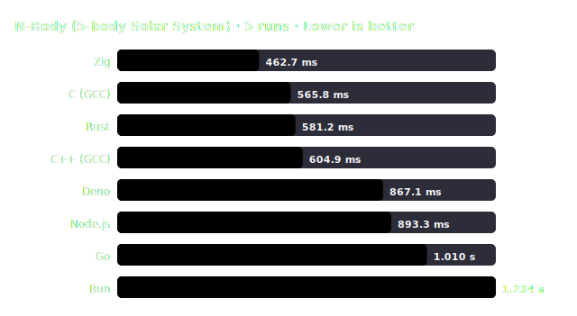

# Benchmark Report: N-Body (5-body Solar System) — 2026-07-03_linux_x86_64_run1

> **Benchmark Variant:** 20M steps. Floating-point numerical loop.

## 🖥️ System Environment

| Field | Value |
| :--- | :--- |
| Date | 2026-07-03, 18:27:27 |
| OS | Linux 7.0.14-zen1-1-zen |
| CPU | Intel(R) Core(TM) i5-14600KF |
| Cores / Threads | N/A cores, N/A threads |
| RAM | N/A @ N/A |

## 🛠️ Compiler / Runtime Configuration

| Language | Runtime / Compiler | Optimization Flags | Notes |
| :--- | :--- | :--- | :--- |
| C | GCC 16.1.1 | `-O3 -march=native -ffast-math` | |
| C++ (GCC) | G++ 16.1.1 | `-O3 -march=native -ffast-math` | |
| Rust | rustc 1.96.1 | `opt-level=3, codegen-units=1, panic=abort, target-cpu=native, lto=thin` | |
| Zig | zig 0.16.0 | `-O ReleaseFast` | |
| Go | go 1.26.4 | `-ldflags "-s -w"` | |
| JavaScript (Node) | node v24.18.0 | — | V8 engine JIT |
| JavaScript (Deno) | deno 2.9.1 | — | Deno V8 engine JIT |
| JavaScript (Bun)  | bun 1.3.14  | — | JSC engine JIT |

## ✅ Correctness Verification

Checked with a rapid workload size of `1000`:

| Runtime | Check Value / Output | Result |
| :--- | :--- | :---: |
| C (GCC) | `Before: -0.169075164, After: -0.169087605` | ✅ PASS |
| C++ (GCC) | `Before: -0.169075164, After: -0.169031665` | ✅ PASS |
| Rust | `Before: -0.169075164, After: -0.169087605` | ✅ PASS |
| Zig | `Before: -0.169075164, After: -0.169087605` | ✅ PASS |
| Go | `Before: -0.169075164, After: -0.169087605` | ✅ PASS |
| Node.js | `Before: -0.169075164, After: -0.169087605` | ✅ PASS |
| Deno | `Before: -0.169075164, After: -0.169087605` | ✅ PASS |
| Bun | `Before: -0.169075164, After: -0.169087605` | ✅ PASS |

## 📊 Performance Chart

## 📈 Results (sorted by mean time)

| # | Runtime | Version [Flags] | Min | Median | Mean | Max | StdDev | CV | Relative Runtime |
| :---: | :--- | :--- | :---: | :---: | :---: | :---: | :---: | :---: | :---: |
| 1 | **Zig** | zig 0.16.0 `[-O ReleaseFast]` | 457.1 ms | 463.9 ms | 462.7 ms | 465.6 ms | 3.3 ms | 0.7% | 1.00× _(fastest)_ 🏆 |
| 2 | **C (GCC)** | GCC 16.1.1 `[-O3 -march=native -ffast-math]` | 559.9 ms | 565.8 ms | 565.8 ms | 572.7 ms | 5.9 ms | 1.0% | 1.22× |
| 3 | **Rust** | rustc 1.96.1 `[-C opt-level=3 ... lto=thin]` | 574.7 ms | 579.2 ms | 581.2 ms | 593.2 ms | 7.1 ms | 1.2% | 1.26× |
| 4 | **C++ (GCC)** | G++ 16.1.1 `[-O3 -march=native -ffast-math]` | 598.2 ms | 601.6 ms | 604.9 ms | 617.4 ms | 7.6 ms | 1.3% | 1.31× |
| 5 | **Deno** | deno 2.9.1 `[V8 JIT]` | 864.9 ms | 867.4 ms | 867.1 ms | 869.5 ms | 1.8 ms | 0.2% | 1.87× |
| 6 | **Node.js** | node v24.18.0 `[V8 JIT]` | 884.0 ms | 890.2 ms | 893.3 ms | 905.7 ms | 9.2 ms | 1.0% | 1.93× |
| 7 | **Go** | go 1.26.4 `[-ldflags "-s -w"]` | 1.005 s | 1.012 s | 1.010 s | 1.014 s | 3.7 ms | 0.4% | 2.18× |
| 8 | **Bun** | bun 1.3.14 `[JSC JIT]` | 1.231 s | 1.234 s | 1.234 s | 1.237 s | 2.5 ms | 0.2% | 2.67× |

## 📝 Methodology & Notes

- Measures pure floating point loop arithmetic and CPU pipeline scheduling.
- All implementations use standard double precision floats and identical initial conditions.
- Hyperfine includes a warmup iteration to eliminate JIT startup overhead.
